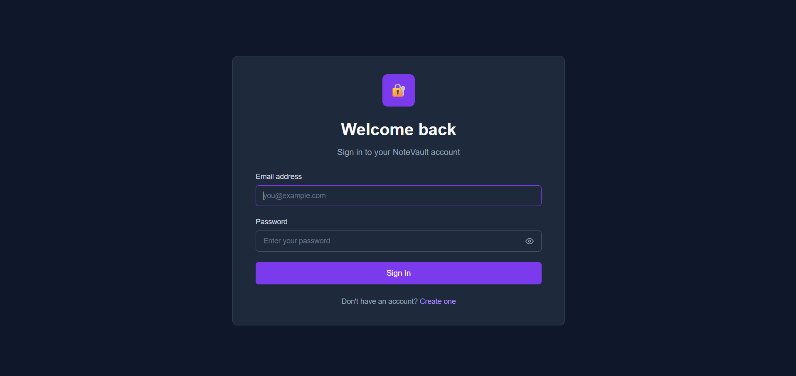
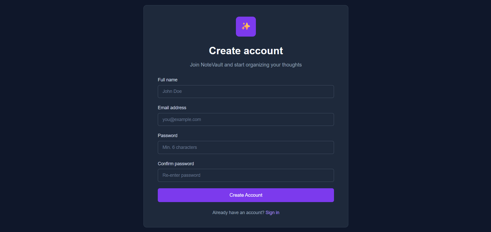
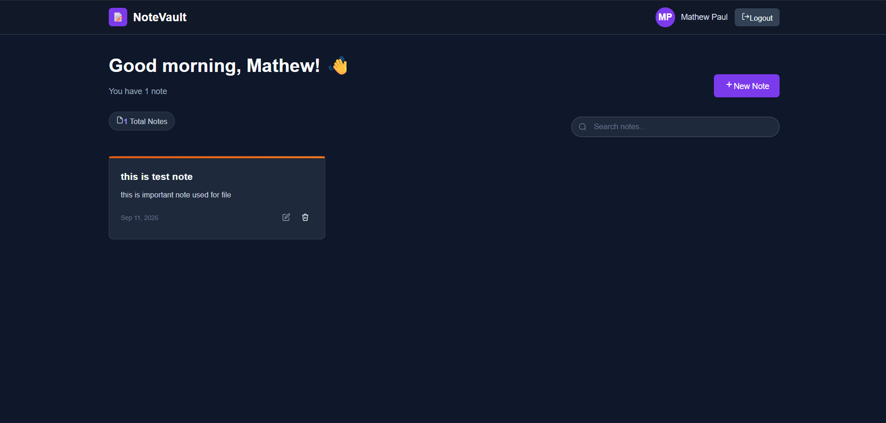

# Notes App

A simple full-stack notes app where users can register, log in, and manage their own notes (create, edit, delete).

## Screenshots

**Login**


**Register**


**Notes Dashboard**


## Tech Stack

- **Frontend:** React
- **Backend:** Node.js, Express
- **Database:** MongoDB
- **Auth:** JWT (JSON Web Token)

## Features

- Register and login
- Passwords are hashed before saving (bcrypt)
- Only logged-in users can access their notes
- Add, edit, and delete notes
- Logout functionality

## Project Structure

```
notes-app/
├── backend/     # Express API (auth + notes routes)
└── frontend/    # React app
```

## How to Run

### Backend
```bash
cd backend
npm install
cp .env.example .env   # add your MongoDB URI and JWT secret
npm run dev
```

### Frontend
```bash
cd frontend
npm install
cp .env.example .env
npm run dev
```

Backend runs on `http://localhost:5000`
Frontend runs on `http://localhost:5173`

## API Routes

| Method | Route | Description |
|--------|-------|-------------|
| POST | /api/auth/register | Register a new user |
| POST | /api/auth/login | Login user |
| GET | /api/notes | Get all notes of logged-in user |
| POST | /api/notes | Create a note |
| PUT | /api/notes/:id | Update a note |
| DELETE | /api/notes/:id | Delete a note |

## What I Learned

- Building a REST API with Express
- Authenticating users with JWT
- Hashing passwords with bcrypt
- Connecting React frontend to a backend API using Axios
- Protecting routes so users can only see their own data
